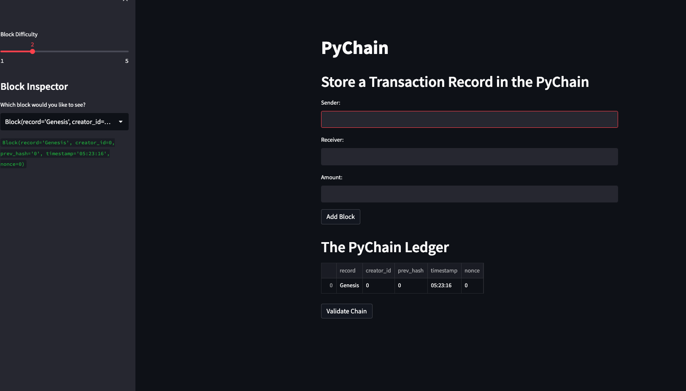
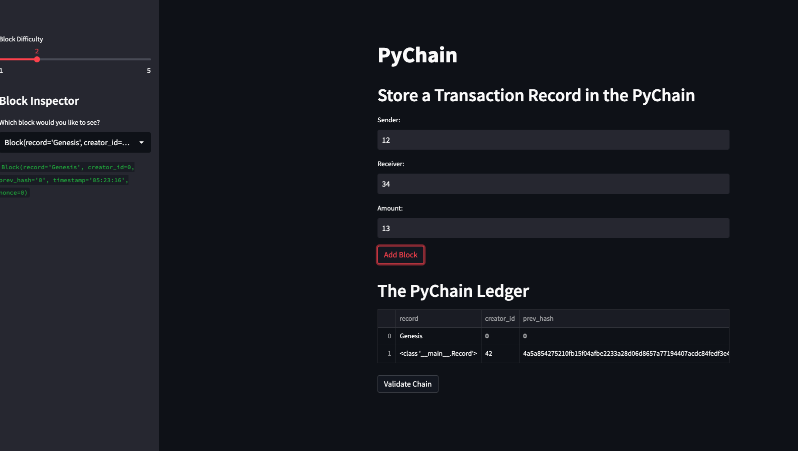
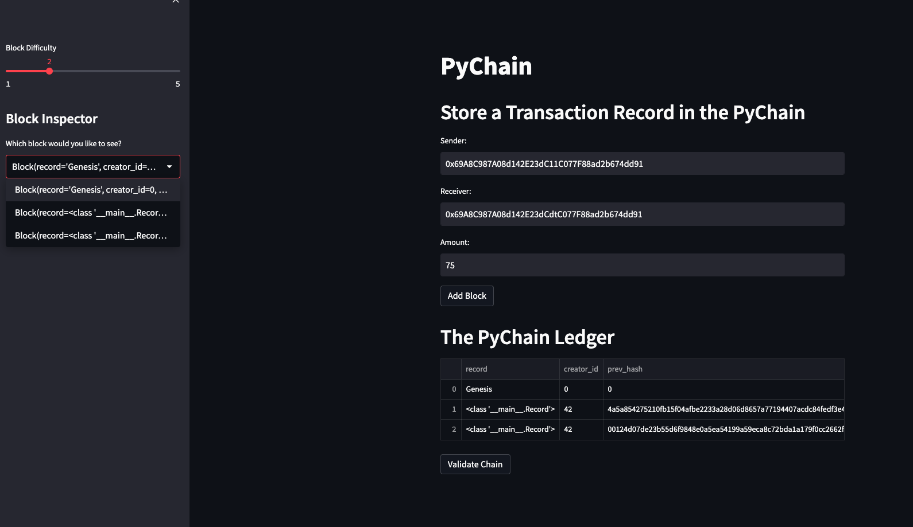
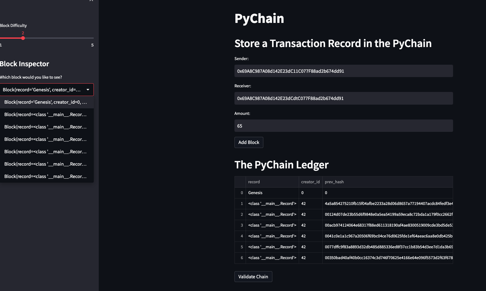

# PyChain Ledger

## Required Installs:
streamlit, dataclass, typing(Any, List), datetime, pandas, hashlib
## Streamlit Images:

## Instructions:
Using terminal navigate to the folder containing pychain.py and enter "streamlit run pychain.py", this will open a seperate browser window where you will be able to add transactions to the blockchain!!!
### Created By:
Ben Spiegel
